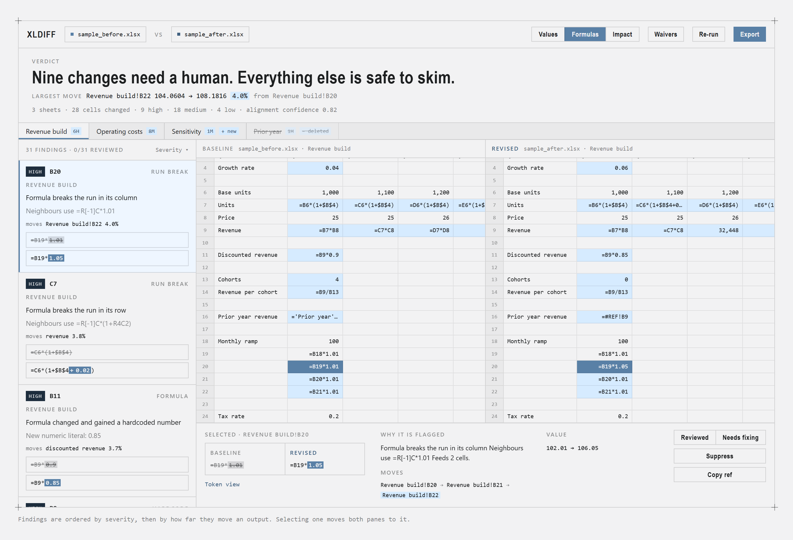
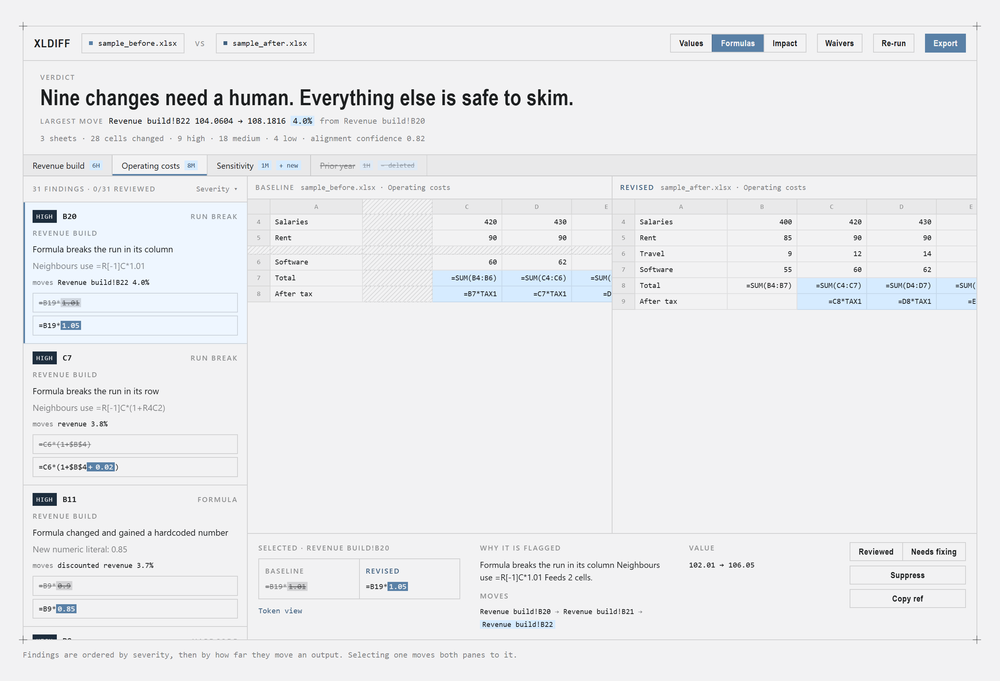
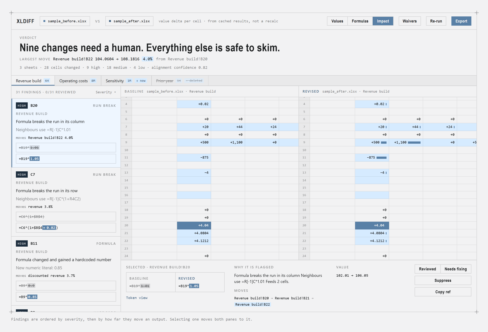

<div align="center">

# xldiff

**Compare two Excel models. See which cells changed, which changes are hardcodes or
broken formula runs, and which number each one moved.**

[](https://github.com/mholovetskyi/xldiff/actions/workflows/tests.yml)

</div>

<div align="center">
  
</div>

---

Reviewing a spreadsheet takes longer than editing one, which is why review is where
models break. The errors that survive review are rarely dramatic: someone drag-fills a
formula across a row that held one deliberate exception, or drops a plug into a
calculated row. Nobody catches it until the number is in front of a client.

xldiff looks for those things specifically, traces each one forward to the output it
moved, and ranks what it finds by how far it moved it.

> **Nothing you compare is uploaded anywhere.** The web app reads both files in the
> browser and makes no network requests at all — load the page once, then pull the
> plug and it still works. The command line tool is equally offline.

## `index.html` is the app

Not a build artefact, not a landing page. **`index.html` in the root of this repository
*is* xldiff** — SheetJS and the engine are inlined into that one file, so it runs from
disk, from a USB stick, from a network share, or from any static host. Download it,
double-click it, done. There is nothing to install and nothing to sign up for.

```bash
# it really is just the one file
curl -O https://raw.githubusercontent.com/mholovetskyi/xldiff/main/index.html
```

It is committed rather than built on deploy so that GitHub Pages can serve it directly,
and CI fails if it ever drifts from a fresh build of its sources.

<div align="center">
  
</div>

## Two ways to run it

**Browser.** Open `index.html`, drop the old file on the left and the new one on the
right.

The review screen opens on the worst finding and leads with a verdict derived from the
counts, so *does this need me?* is answered before you scroll. Findings sit beside the
two sheets; selecting one moves both panes to it and shows the formula diff with the
changed tokens marked. Panes read as **Values**, **Formulas** or **Impact**. Export
writes a self-contained HTML report, JSON for a CI gate, a waiver file, or a copy of the
workbook with the findings as cell comments.

**Command line.** For pre-commit hooks and CI:

```bash
pip install -r cli/requirements.txt
python cli/cli.py old.xlsx new.xlsx -o report.html
python cli/cli.py base.xlsx head.xlsx --quiet --fail-on high   # exits 1 on high findings
```

Try it on the included examples, which have four bugs seeded into them:

```bash
python cli/cli.py examples/model_v14.xlsx examples/model_v15.xlsx
```

`examples/sample_before.xlsx`, `sample_interim.xlsx` and `sample_after.xlsx` are three
versions of a second model, seeded to fire one finding of every class at once — drag two
of them onto the web app to see what a full report looks like. Regenerate or edit them
with `node examples/make_samples.js`, which needs nothing beyond the SheetJS already
installed for the web build.

<details>
<summary><b>Everything else the CLI does</b></summary>

```bash
python cli/cli.py old.xlsx new.xlsx --annotate reviewed.xlsx    # findings as cell comments
python cli/cli.py old.xlsx new.xlsx --outputs "Summary!B10"     # rank against your outputs
python cli/cli.py old.xlsx new.xlsx --json findings.json        # machine-readable
python cli/cli.py old.xlsx new.xlsx --write-waivers w.json      # waiver template to edit
python cli/cli.py old.xlsx new.xlsx --waivers w.json            # honour past decisions
python cli/lineage.py models/*.xlsx --kind hardcode             # when did this appear
python cli/lineage.py models/*.xlsx --cell "Model!D9"           # follow one cell
```

</details>

## What it catches

| Finding | Severity | Why it matters |
|---|:---:|---|
| Hardcode replaced a formula | 🔴 high | The cell stopped recalculating. The classic plug. |
| Formula breaks the run in its row or column | 🔴 high | Someone drag-filled over a deliberate exception, or created one by accident. |
| Formula changed and gained a numeric literal | 🔴 high | An assumption got buried inside a calculation. |
| Cell now evaluates to an error | 🔴 high | `#DIV/0!`, `#VALUE!` and friends, where a number used to be. |
| Formula lost a reference | 🔴 high | The text reads `#REF!`. Whatever it pointed at is gone. |
| Named range deleted or repointed | 🔴 high | Formulas using it changed meaning without changing a character of their text. |
| Formula reads from a different workbook | 🔴 high | A change of source, not of logic, which a text diff buries. |
| Formula changed, constant changed, cell cleared | 🟠 medium | Ordinary edits, shown with the value delta. |
| Value moved with no edit to this cell | 🟠 medium | Downstream impact. Nobody touched this cell; something else moved it. |
| Sheet or column added or deleted, row inserted or deleted | 🔵 low → 🔴 high | Structural context, reported before cell findings. |

Findings are ordered by severity, then by how far they move a model output, then by
position. Most spreadsheet comparison tools order by position, which buries the one
thing that matters under two hundred formatting changes.

## Alignment on both axes

Insert a row at the top of a sheet and a naive comparison reports every cell below it as
changed. That is why Microsoft's own Spreadsheet Compare is unusable on real models.

Below, the revised file has gained **a column and a row** — `FY prior` at B and `Travel`
at row 6. The baseline shows both as hatched gaps, the quarters either side stay lined
up, and the only things reported are the insertions themselves and the four `SUM`
formulas whose range genuinely widened.

<div align="center">
  
</div>

## The Impact layer

Every cell rendered as its value delta, with bars scaled against the largest move on
screen. Cells that did not move read `+0`.

<div align="center">
  
</div>

## How it works

**R1C1 normalisation.** Formulas are compared in R1C1 form, so a formula that moved to a
new position without changing its logic does not register as a change.

**Row and column alignment before diffing.** Rows are fingerprinted by label text plus a
shape string — which cells hold formulas, text, numbers, nothing — and the two sequences
are aligned with LCS. The fingerprint deliberately ignores formula *content*, so a row
whose formula was edited still matches its counterpart. Columns are aligned the same
way, fingerprinted over the rows that already aligned.

<details>
<summary><b>Why the two axes are circular, and how the knot is cut</b></summary>

A row fingerprint spans every column, so inserting one column changes the shape of every
row at once — and a column fingerprint spans every row, so inserting one row does the
same in reverse. Each axis needs the other solved first. Unconstrained, row alignment
collapsed to *zero* on a sheet that gained a single column.

The fix is to run-length normalise the shape string: `tnnnn` and `tnnnnn` both read `tn`.
The fingerprint records the pattern of cell kinds rather than how many columns each run
spans, which makes it invariant to insertions on the other axis.

</details>

**Impact without a formula engine.** An `.xlsx` stores the last value Excel calculated
for every cell. Reading formulas and cached values together gives you value deltas for
free, and the useful signal falls out of it: a cell whose formula is unchanged but whose
value moved is downstream of an edit somewhere else. If a file was saved with calculation
set to manual the cache is stale, so the tool detects that and warns rather than
reporting a number it cannot stand behind.

**Run-break detection.** For any changed cell, read its contiguous neighbours in R1C1,
across the row first and then down the column. Uniform neighbours plus a different cell
is a break. The reverse — a cell that used to differ and now matches — is reported as a
repair at low severity, so a real fix does not crowd out real problems.

<details>
<summary><b>Why a vertical run needs a rule a horizontal one does not</b></summary>

A column of identical formulas nearly always ends in a total that is *meant* to differ.
Unconstrained, the vertical axis reported every `SUM` under a uniform column as a
high-severity break. A vertical break now only counts when the run continues on both
sides of the odd cell.

Rows do not need this: a row of quarters is a homogeneous series to its last column, and
applying the same rule there would blind the tool to a break in the final period.

</details>

**Dependency chains.** Precedents are parsed out of every formula — cross-sheet
references, ranges, and defined names resolved to their targets — and the reverse graph
answers what each change feeds. A finding carries the path forward to the furthest cell
whose value actually moved: the difference between *this changed* and *this changed, and
here is the number it landed on*.

It is not a formula parser. Array formulas, structured table references and `INDIRECT`
are invisible to it, and that asymmetry is deliberate — a missed edge shortens a chain
rather than inventing one.

**Ranking against outputs.** Leaves of that graph — calculated cells nothing else reads —
are what a model exists to produce, so findings are ordered by how far they move them.

<details>
<summary><b>Why a plug is the exception that proves the rule</b></summary>

A hardcode *freezes* a number rather than moving it, so the single most dangerous finding
in the tool measures exactly zero output movement by construction. Ranking on movement
alone buried it beneath every unrelated finding. Findings that sit on an output break the
tie above those that touch none.

On the sample pair the plug lands fourth of nine high findings — behind the three that
visibly moved something, ahead of everything inert.

</details>

## Reviewing and sign-off

Findings can be marked reviewed or flagged for fixing, and the exported report opens with
a sign-off block: who looked, how many findings and how many high ones they got through,
how many they flagged. The *unreviewed* state is the one that earns its keep — "no high
findings outstanding" and "nobody opened the file" are different claims, and a report
without that distinction cannot tell them apart.

Suppressing a finding writes a **waiver**, a file you commit next to the model:

```bash
python cli/cli.py old.xlsx new.xlsx --write-waivers waivers.json   # template to edit
python cli/cli.py old.xlsx new.xlsx --waivers waivers.json --fail-on high
```

Waived findings never fail the gate. Waivers matching nothing are reported rather than
ignored — that usually means the change they covered was edited again, and silence would
let them rot.

<details>
<summary><b>How a waiver survives a re-run but not a re-edit</b></summary>

Every finding carries an eight-character id: FNV-1a over its kind, location, and the
before and after text. Both engines compute it identically, so a finding suppressed by
clicking in the browser is honoured by the CLI gate in CI.

The id deliberately covers the change itself. Edit the formula again and the id moves,
because a waiver records that someone accepted a *specific* change — not that a cell is
permanently uninteresting.

</details>

## Layout

```
index.html          the app itself, self-contained and committed
web/                app template, engine.js, build script
cli/                Python engine, report writer, CLI, waivers, annotator, lineage
examples/           small models with seeded bugs, and their generators
docs/               screenshots used by this README
tests/              engine, parity, waiver, lineage and annotation checks
```

`web/engine.js` and `cli/engine.py` implement the same algorithm and produce identical
findings on the same inputs. That is not a claim anyone should take on trust:
`tests/test_parity.py` runs both over every example pair, and each pair reversed, and
diffs the results field by field including the finding ids. It found four real
divergences the first time it ran.

## Building the web app

```bash
cd web
npm install
node build.js        # regenerates ../index.html
node ../tests/test_engine.js
```

CI fails if `index.html` drifts from a fresh build of the sources, and separately if the
app script inside it does not parse — a build can match its sources perfectly and still
ship a page that loads and does nothing.

## Performance

25 sheets, 700 rows, 14 columns per side, roughly 245,000 cells: about 2.3 seconds. The
alignment strips the common prefix and suffix before doing any quadratic work, so cost
scales with how much actually diverged rather than with file size.

## Known limits

- No formula evaluation. Impact is read from the values Excel cached, so a file saved
  with calculation on manual is detected and warned about rather than guessed at.
- Precedents are parsed, not interpreted. `INDIRECT`, `OFFSET`, array formulas and
  structured table references produce no graph edges, which shortens chains.
- Sheet-local defined names are ignored; only workbook-level names are compared.
- `.xlsx` and `.xlsm` only. No `.xlsb`, no `.xls`, no Google Sheets.
- Formatting changes are ignored rather than collapsed into a category. A number format
  switched from percent to decimal is invisible here and is a real source of bugs.
- Capped at 60 columns, 5000 rows per sheet, 25 impact findings, and 60 detected outputs.
- The annotated workbook loses cached values, because openpyxl does not preserve them.
  Excel recalculates on open; do not feed that copy back into xldiff.
- Merging two versions is out of scope and likely to stay that way.

## Contributing

The most useful contribution right now is not code. Run it on a real model you have two
versions of, and open an issue about what it got wrong: a finding that should have been
high and was not, noise that should have been suppressed, an alignment that fell apart.
The algorithm was tuned against synthetic fixtures, which hide exactly the problems that
matter.
